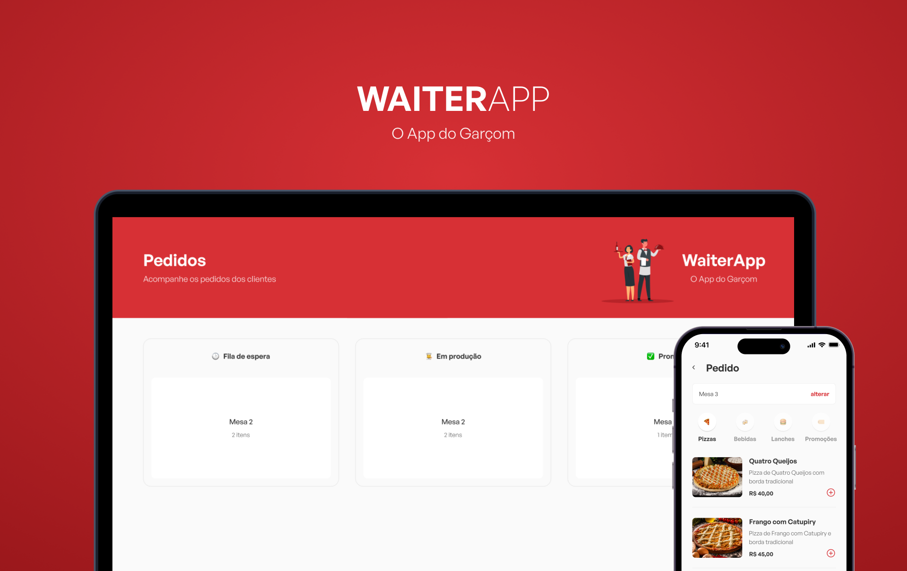

<p align="center">
  
</p>

<p align="center">
  <a href="https://www.typescriptlang.org/">
    
  </a>
  <a href="https://nodejs.org/">
    
  </a>
  <a href="https://reactjs.org/">
    
  </a>
  <a href="https://reactnative.dev/">
    
  </a>
  <a href="https://www.mongodb.com/">
    
  </a>
  <a href="https://expo.dev/">
    
  </a>
</p>

<br />

## Tópicos

<div>
 • <a href="#-sobre-o-FitLife">Sobre o WaiterApp</a> </br>
 • <a href="#-tecnologias">Tecnologias</a> </br>
 • <a href="#-layout">Layout</a> </br>
 • <a href="#-funcionalidades">Funcionalidades</a> </br>
 • <a href="#-estrutura-do-banco-de-dados">Estrutura do banco de dados</a> </br>
 • <a href="#-como-executar-o-projeto">Como executar</a> </br>
 • <a href="#-como-contribuir">Como contribuir</a> </br>
 • <a href="#-autor">Autor</a> </br>
 • <a href="#user-content--licença">Licença</a></br>
</div>

## 👨‍🍳 Sobre

**WAITER**APP é um software de gerenciamento de pedidos para restaurantes!

Nele, o garçom pode anotar os pedidos pelo app e enviar para o dashboard web. O dashboard web foi dividido em 3 colunas: 🕒 Fila de espera, 👨‍🍳 Em produção e ✅ Pronto!

O projeto foi desenvolvido inteiramente em Typescript durante o evento [O Poder do JS](https://opoderdojs.jstack.com.br/),
pelo [Mateus Silva](https://www.linkedin.com/in/mateusilva/).

<br />

## 🚀 Tecnologias

Tecnologias e ferramentas utilizadas no desenvolvimento do projeto:

#### **Website** ( [ReactJS](https://reactjs.org/) + [TypeScript](https://www.typescriptlang.org/) )

-  [StyledComponents](https://styled-components.com/)
-  [SocketIo](https://socket.io/)
-  [React Toastify](https://github.com/fkhadra/react-toastify)

#### **Mobile** ( [React Native](https://reactnative.dev/) + [TypeScript](https://www.typescriptlang.org/) )

-  [Expo](https://expo.dev/)
-  [StyledComponents](https://styled-components.com/)

#### **API** ( [NodeJS](https://nodejs.org/en/) + [TypeScript](https://www.typescriptlang.org/) )

-  [Mongoose](https://mongoosejs.com/)
-  [Express](https://expressjs.com/pt-br/)

#### **Utilitários**

-  Banco de dados: **[MongoDb](https://www.mongodb.com/)**
-  Protótipo: **[Figma](https://www.figma.com/)** → **[Protótipo (WaiterApp)](https://www.figma.com/file/dm7tP9X81c5loLur8Z3Y91/WAITERAPP)**
-  Editor: **[Visual Studio Code](https://code.visualstudio.com/)** → Extensions: **[Prettier](https://prettier.io/)** + **[EditorConfig](https://editorconfig.org/)**
-  Fontes: **[General Sans](https://www.fontshare.com/fonts/general-sans)**
-  Versionamento: **[Git](https://git-scm.com)**
-  Padronização de código: **[ESLint](https://eslint.org/)**

## 🎨 Layout

Os layouts do app estão disponíveis no **Figma**: https://www.figma.com/file/dm7tP9X81c5loLur8Z3Y91/WAITERAPP

<p align="center">
  
</p>

<br />

## ⚙️ Funcionalidades

Afim de manter uma dinâmica e uma conexão em tempo real entre as interfaces, realizamos a comunicação entre o dashboard web e a api utilizando web-socket.

O Web socket permite uma comunicação em duplo sentido entre o front-end e o back-end. De tal maneira que, deixamos o front-end "ouvindo" um determinado canal de comunicação. E quando realizamos uma alteração no back-end, ele retorna uma comunicação nesse canal que o front-end está "ouvindo".

E a partir disso, o front-end executa uma ação, que no nosso caso, é atualizar os dados que estão sendo exibidos em tela.

<br />

## 🎲 Estrutura do banco de dados


<br />

## 🚀 Como executar o projeto

Este projeto é divido em três partes:

1. Backend (pasta api)
2. Frontend Web (pasta fe)
3. Frontend Mobile (pasta app)

💡 O Frontend precisa que o Backend esteja sendo executado para funcionar.

### Pré-requisitos

Antes de começar, você vai precisar ter instalado em sua máquina as seguintes ferramentas: <br />
→ [Git](https://git-scm.com);<br />
→ [Node.js](https://nodejs.org/en/);<br />

Além disto é bom ter um editor para trabalhar com o código como [VSCode](https://code.visualstudio.com/);

Para executar o banco de dados MongoDb, foi utilizado a aplicação do [MongoDB Community](https://www.mongodb.com/try/download/community), mas existem outras alternativas como o [Docker container](https://www.docker.com/resources/what-container/)

#### 🎲 Rodando a aplicação (Backend)

```bash
# Clone este repositório
$ git clone https://github.com/vitorrsousaa/WaiterApp.git
# Vá para a pasta da aplicação Front End
$ cd api
# Instale as dependências
yarn install
# Rode a aplicação
yarn start
# A aplicação será aberta na porta:3001 - acesse http://localhost:3001
```

---

#### 🧭 Rodando a aplicação web (Frontend)

```bash
# Clone este repositório
$ git clone https://github.com/vitorrsousaa/WaiterApp.git
# Vá para a pasta da aplicação Front End
$ cd client
# Instale as dependências
yarn install
# Rode a aplicação
yarn start
# A aplicação será aberta na porta:5173 - acesse http://localhost:5173
```

---

#### 🧭 Rodando a aplicação mobile (Frontend)

```bash
# Clone este repositório
$ git clone https://github.com/vitorrsousaa/WaiterApp.git
# Vá para a pasta da aplicação Front End
$ cd app
# Instale as dependências
yarn install
# Rode a aplicação
yarn start
# A aplicação será visualizado através do [Expo](https://expo.dev/) em um dispositivo físico ou emulador (Android ou iOS)
```

---

# 💭 Como contribuir

Caso queira contribuir, seja corrigindo bugs, adicionando comentários ou novas features, você pode seguir o seguinte tutorial:

-  Faça um **[fork](https://help.github.com/pt/github/getting-started-with-github/fork-a-repo)** desse repositório
-  **[Clone](https://help.github.com/pt/github/creating-cloning-and-archiving-repositories/cloning-a-repository)** o repositório que você fez o fork em seu computador
-  Crie uma branch com a sua feature: `git checkout -b minha-alteracao`
-  Envie suas alterações para a _staging area_: `git add .`
-  Faça um commit contando o que você fez: `git commit -m "feat: minha nova alteracao!"`
-  Faça um push para a sua branch: `git push origin minha-alteracao`
-  Agora é só abrir uma _pull request!_

_Caso tenha alguma dúvida, confira este [guia de como contribuir no GitHub](https://github.com/firstcontributions/first-contributions/blob/master/translations/README.pt_br.md) :)_

<br />

# 📝 License

Esse projeto está sob a licença MIT. Consulte [LICENSE](https://github.com/vitorrsousaa/WaiterApp/blob/main/LICENSE) para mais informações.

<br />

# 📮 Entre em contato

**Linkedin**: https://www.linkedin.com/in/vitorr-sousaa/

Desenvolvido por **Vitor Sousa** 👋🏻🧑
